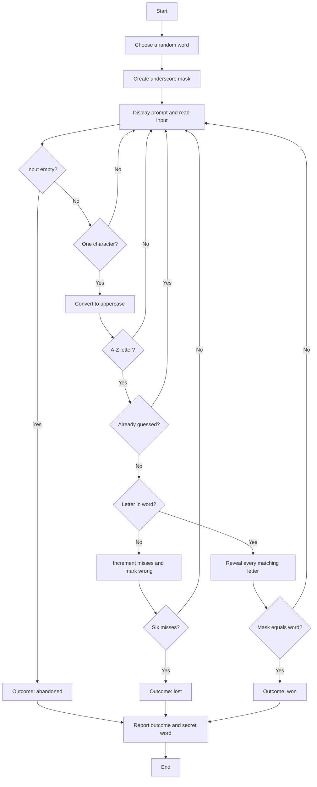

# Execution Flow

All ports follow the same V2-style sequence, even where a language expresses the loop differently.

## Detailed loop

1. Choose a word, create a same-length underscore mask, clear the tracker, and set misses to zero.
2. Display the current message, mask, miss count, and incorrect-letter list.
3. Treat empty input as abandonment. Reject input longer than one character.
4. Uppercase one-character input and reject anything outside A-Z.
5. Reject a letter already recorded as right or wrong.
6. For a new wrong letter, increment misses and end after the sixth miss.
7. For a new correct letter, reveal all of its occurrences and end when the mask matches the secret word.
8. Print the outcome and the secret word.
